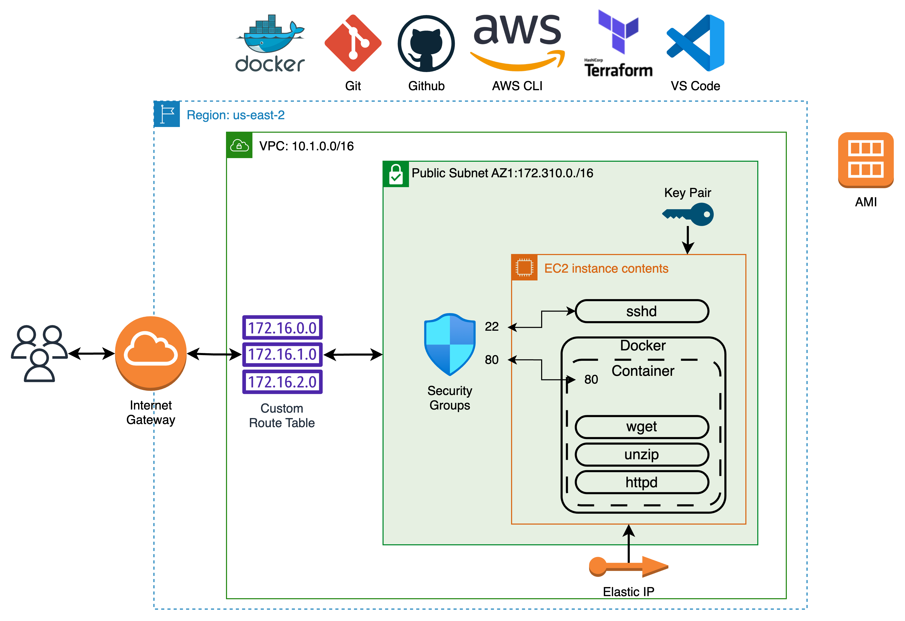

# Terraform Docker Container in AWS EC2

## Overview

Tools:
* Amazon EC2 key pair
* AWS Command Line Interface (AWS CLI)
* Docker Hub
* Visual Studio Code
* Git/GitHub
* Bash
* Terraform
* Docker
* Amazon Elastic Compute Cloud (Amazon EC2)
* SSH
* wget



## Prerequisites

1. Docker Hub account with password stored securely (read-only to current local user) on your computer
2. AWS CLI configuration
3. Terraform installed and initialized in Project folder
4. AWS EC2 Key Pair created

## Steps performed by Terraform

1. Create EC2 Instance.
    1. Allow HTTP & SSH access.
    2. Configure EC2 with existing Key Pair.
2. Connect to the EC2 instance using SSH.
    1. Install and enable Docker in EC2.
    2. Build image from `amazonlinux:latest`.
        1. Update image adding `httpd`, `wget`, and `unzip`.
        2. Download and unzip static web site content from GitHub.
        3. Cleanup and start `httpd`.
    3. Tag and push image to pre-existing Docker Hub repository.
    4. Run Docker container using built image.

The pattern for this project (Docker Container in EC2 built from image in Docker Hub) is a bit dated. It is likely more prevalent to use AWS ECR and ECS or EKS.

The last output from the `terraform apply` is a URL for the container:

>container_url = "http://<EC2-INSTANCE-PUBLIC-IPV4-DNS>"

Use this to browse to the website installed or connect via `ssh` with:

```bash
ssh -i ~/.ssh/my-ec2-key-pair.pem ec2-user@<EC2-INSTANCE-PUBLIC-IPV4-DNS>
```
